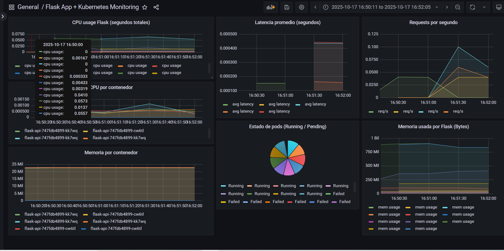
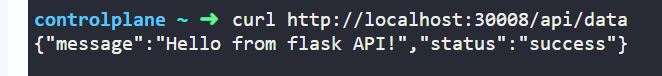

# Flask API Project

## Overview
This repository contains a **Flask API project** deployed on Kubernetes with monitoring using Prometheus and Grafana.

## Project Structure

```
flask-on-kubernetes/
├── app/
│   ├── static/              # Static files
│   └── templates/           # HTML templates
├── docker/                  # Dockerfile and related files
├── docs/                    # Screenshots
├── k8s/                     # Kubernetes manifests
│   └── prometheus/          # Prometheus & Grafana configs
└── README.md
```

## Quick Start

### Clone the project
```bash
git clone https://github.com/victornaya-dev/flask-on-kubernetes
```
Apply all Kubernetes manifests

```bash
kubectl apply -f flask-on-kubernetes/k8s -R
```

Note: This assumes Prometheus Operator is installed.

Check if Prometheus Operator is installed

```bash
kubectl get pods --all-namespaces | grep operator
```

If there is a pod with a name similar to kube-prometheus-stack-operator-xxxx, the operator is installed.

Access the Flask API
Open the API in your browser or via curl at:

```bash
http://<node-ip>:30008
```


For local clusters (like Minikube), you can use:

```bash
http://localhost:30008
```

Import Grafana Dashboard
Import the dashboard JSON located at:

```bash
k8s/prometheus/grafana-dashboard.json
```

### Monitoring & Metrics

Prometheus scrapes metrics from the Flask app using the /metrics endpoint.
The Grafana dashboard includes:
- CPU usage per container
- Memory usage per container
- Requests per second
- Average latency
- Pod status (Running / Pending)



### Docker Image (Optional)

The Docker image for this project is available on Docker Hub:
victordock218/myapp_flask_v003:tagname

However, you can also build and run the image locally if you prefer to customize it.

```bash
docker build -t myapp_flask_v003:latest .
```

(Optional) Tag it if you want to push later:
```bash
docker tag myapp_flask_v003:latest victordock218/myapp_flask_v003:tagname
```

Run the container locally:
```bash
docker run -p 80:80 myapp_flask_v003:latest
```

You can now access the Flask API at:
```bash
http://localhost:80
```

## TEST
Once your Flask app is running (for example, via Docker, Kubernetes, or directly with python app.py), you can test it with:
```bash
curl http://localhost:30008/api/data
```

Expected response:
```bash
{"message": "Hello from flask API!", "status": "success"}
```



